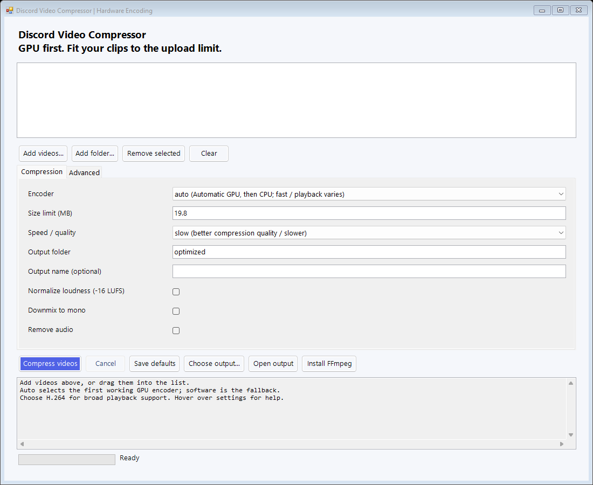

# Discord Video Compressor — Hardware Encoding

Un compresseur local pour Discord, avec **encodage matériel par défaut** et une
**interface graphique Windows**. Fork MIT de [Discord Shrinkwrap, par nunogomes255](https://github.com/nunogomes255/discord-video-compressor).
Merci à Nuno pour le pipeline original et les sondes d’encodeurs ! Son copyright est conservé.

## Utilisation sous Windows

1. Télécharger le ZIP portable dans les **[Releases](https://github.com/SpiRaL-network/discord-video-compressor-hw-encoding/releases/latest)**,
   ou avec **Code → Download ZIP**, puis extraire tout le dossier.
2. Double-cliquer sur **`open_compressor.bat`**.
3. Au besoin, cliquer sur **Install FFmpeg** : la version est fixée et le téléchargement
   est vérifié par SHA-256. Une installation existante sur `PATH` fonctionne aussi.
4. Ajouter les vidéos ou un dossier, ou les déposer dans la liste.
5. Garder **Encoder = auto**, régler la limite et éventuellement **Output name**, puis cliquer sur **Compress videos**.
6. Cliquer sur **Open output** pour retrouver les vidéos et les rapports.



Pas besoin de Python ni de navigateur. Windows PowerShell 5.1 et .NET sont inclus
avec Windows 10/11. L’interface est en anglais ; les réglages ont des infobulles.
Le lanceur historique **`drag_videos_here.bat`** reste utilisable.

## Ce qui change

- Détection automatique : **AV1 → HEVC → H.264** sur GPU, puis repli logiciel x265/x264.
  Chaque candidat doit réussir un véritable encodage de test. L’ordre est modifiable.
- Interface : encodeur, qualité/vitesse, limite, dossier et nom de sortie, normalisation audio,
  mono, suppression du son, débits audio, débit vidéo minimum, tentatives, qualité de
  secours, priorités d’encodeurs, conservation des logs et sauvegarde des préférences.
- Menus explicatifs : fournisseur, codec, avantages et compromis dans les choix
  d’encodeur ; conseils pour les presets et la qualité de secours.
- Limite exacte en **Mo décimaux** : `19.8` signifie au plus **19 800 000 octets**.
  Le débit vidéo est calculé automatiquement selon la durée et le budget audio.
- Nettoyage limité au dossier temporaire de l’exécution ; protection des sorties
  existantes ; corrections des chemins spéciaux, des options audio et du découpage.
- Tests réels sous Windows et Linux, avec contrôles automatiques sur GitHub.

AV1/HEVC privilégient l’efficacité ; pour une lecture largement compatible, choisir
un encodeur **H.264** (`h264_nvenc`, `h264_amf`, `h264_qsv` ou `libx264`).
L’encodage matériel accélère la vidéo, mais le décodage, les filtres et l’audio peuvent
toujours utiliser le processeur. La sélection automatique suit une priorité de codecs,
elle ne mesure pas la qualité de tous les GPU.

**Save defaults** sauvegarde `shrinkwrap.conf`, également lu par les scripts CLI.
Un ancien réglage `mode = software` reste respecté : sélectionner `auto` puis sauvegarder
pour passer au nouveau comportement. **Cancel** arrête aussi FFmpeg ; les vidéos terminées sont conservées.

## Nom de sortie et réglages

**Output name** permet de nommer le résultat sans toucher à l’original. Vide, il conserve
`clip_optimized.mp4`. Saisir `Mon clip` ou `Mon clip.mp4` produit `Mon clip.mp4`.
Si le fichier existe, le nouveau devient `Mon clip (2).mp4`, puis `(3)`, etc.
Les sources portant le même nom dans un lot sont également distinguées automatiquement.

Pour les lots, `{name}` reprend le nom de la source et `{index}` son numéro sur trois
chiffres : `Discord {name} {index}` devient `Discord clip 001.mp4`.
Un nom constant devient `Mon clip_001.mp4`, `Mon clip_002.mp4`. Les morceaux découpés
ajoutent `_PART_…`. Le dossier se choisit séparément avec **Output folder**.

Les débits audio AAC acceptent des entiers libres, dont **124 et 127 kbps** : il n’est
pas nécessaire de les limiter à une liste prédéfinie. Les champs numériques permettent
de choisir de 16 à 512 kbps ; le débit initial doit être au moins égal au minimum.
Le débit vidéo est calculé automatiquement, avec un minimum réglable.

**Speed / quality** est un menu de presets avec leur compromis vitesse/qualité.
**Rescue quality (CRF / CQ)** propose des valeurs conseillées et accepte un entier
personnalisé de 1 à 51. Plus bas signifie davantage de détails, mais potentiellement
plus de place. Ce réglage concerne l’encodage de secours ; la résolution s’adapte
automatiquement lorsque la limite l’exige.

## Ligne de commande

```powershell
.\shrinkwrap.ps1 -Files "clip.mp4"
.\shrinkwrap.ps1 -Encoder h264_nvenc -TargetSizeMB 19.8 -Files "clip.mp4"
.\shrinkwrap.ps1 -Encoder software -Files "clip.mp4"
.\shrinkwrap.ps1 -OutputName "Mon clip.mp4" -Files "clip.mp4"
```

```bash
bash shrinkwrap.sh clip.mp4
bash shrinkwrap.sh -c h264_nvenc -t 19.8 clip.mp4
bash shrinkwrap.sh -N 'Discord {name} {index}' clip.mp4
```

Linux/macOS : FFmpeg, ffprobe, bc, awk et Bash 4+ sont nécessaires. Sur macOS,
installer Bash avec Homebrew ; le Bash 3.2 intégré est trop ancien. Le GUI est Windows.

La limite d’envoi peut varier selon le compte et le serveur : utiliser celle affichée
par Discord. Documentation complète, configuration et dépannage : **[README anglais](README.md)**.
Licence : **[MIT](LICENSE)**. Vérifications et limites des essais : **[AUDIT.md](AUDIT.md)**.
